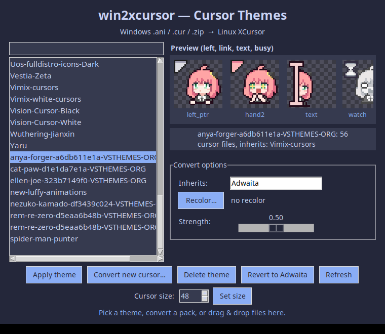

# win2xcursor


I kept downloading nice Windows cursor packs and finding nothing on Linux that would convert them properly — the tools I tried either dropped the animation, messed up the colors, or mapped every cursor to the same arrow. So I wrote my own. It takes `.ani` / `.cur` / `.zip` packs and turns them into real XCursor themes, animation and all.



## What you need

- Python 3 (3.10+ is fine)
- Pillow: `pip install -r requirements.txt` (or `sudo apt install python3-pil`)
- For the GUI: tkinter (`sudo apt install python3-tk`). If `python3` on your machine points at a venv without tkinter, run the GUI with your system python instead, e.g. `/usr/bin/python3 gui.py`.

No other dependencies. That's deliberate.

## Using it

Single pack, straight to your cursor folder, applied right away:

```bash
python3 cursor_converter.py "My Cursor.zip" --theme My-Cursor --install --apply
```

A single animated cursor file:

```bash
python3 cursor_converter.py pointer.ani --theme My-Pointer --install
```

A folder full of `.cur` / `.ani` files:

```bash
python3 cursor_converter.py ./my-cursors --theme My-Theme --out ~/.local/share/icons
```

Want everything in your downloads folder converted at once:

```bash
python3 batch_convert.py --src ~/Downloads/cursors --out ~/.local/share/icons
python3 batch_convert.py --src ~/Downloads/cursors --list   # just preview the names first
```

Or skip the terminal: `python3 gui.py` lists installed themes, shows a preview, applies with one click, and converts new packs with options for the fallback theme, recoloring, and strength. You can also drag and drop `.zip` / `.cur` / `.ani` files (or a folder) straight onto the window — needs the optional `tkinterdnd2` package (`pip install tkinterdnd2`), otherwise the Convert button does the same job.

Optional tint, if you want the whole set pushed toward a color:

```bash
python3 cursor_converter.py "pack.zip" --theme My-Red --recolor 200,60,120 --strength 0.5
```

After applying, log out and back in (or restart apps) — GNOME caches cursors per app, so some windows pick it up late.

On Wayland, `--apply` also adds `~/.local/share/icons` to `XCURSOR_PATH` in
your `~/.profile` (libXcursor requirement — themes there are invisible to
Wayland clients without it). Open a fresh login shell afterwards.

## What's actually happening

- `.ani` files are RIFF/ACON containers. The script reads the `fram` chunks, keeps the `rate` timing (converted from jiffies to ms) and `seq` ordering, so the Linux version animates the same way.
- Some old packs store frames as BMP DIBs instead of PNGs. Those get decoded by hand, including the 1-bit transparency mask, because Pillow can't open them.
- XCursor pixels on little-endian machines are B,G,R,A. Writing them in RGBA order gives you a lovely orange tint on everything — been there, fixed that, there's a test pinning it now.
- File names get mapped to X11 roles (`busy` → `watch`, `link` → `hand2`, diagonal resizes → `size_fdiag`/`size_bdiag`, …), multi-variant zips (dark/light, Static/Windows) become separate themes, and legacy alias names get symlinks.
- Anything the pack doesn't cover falls back to the theme you pick with `--inherit` (default `Adwaita`, always present on GNOME), so you never end up with an invisible cursor.

If a pack already ships a `linux/` folder with `index.theme` + `cursors/`, don't convert it — copy it into `~/.local/share/icons` as is.

## Honest limitations

- Developed and tested on Ubuntu + GNOME. KDE and other desktops will probably work (it's just XCursor files) but I haven't verified `apply` there — installing and selecting via your settings app will still work.
- Big packs (looking at you, 18 MB Pando) take a minute or two to convert. The GUI runs it in the background so it won't freeze.
- Run the test suite with `python3 -m unittest discover -s tests -v`.

## Contributing

Bug reports with the actual pack attached are gold — see [CONTRIBUTING.md](CONTRIBUTING.md). PRs welcome, just keep it dependency-free and add a test.
